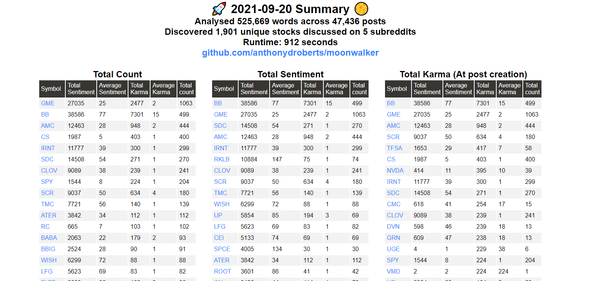

# Moonwalker
This project is a set of NodeJS scripts that use [pushshift](https://pushshift.io/) to scrape the most recent post data from a few popular trading / investing subreddits, and then analyze + generate a report detailing the top stocks based on metrics like content sentiment and karma.

[sentiment](https://www.npmjs.com/package/sentiment) is used to analyze the scraped content.

## Requirements
To run the scripts on your machine:
- Node v13 or higher

If you want to use the automatic emailing, set the following environment variables:

`export MOONWALKER_EMAIL_HOST=<email server host>`

`export MOONWALKER_EMAIL_PORT=<email server port>`

`export MOONWALKER_EMAIL_USER=<account username for authentication>`

`export MOONWALKER_EMAIL_PASS=<account password for authentication>`

`export MOONWALKER_EMAIL_MAILING_LIST=<comma-seperated mailing list>`

Running the github actions workflow also requires that these environment variables are set as repository secrets

## Usage

Install the dependencies with `npm install` and then run the scripts with `npm run sanity` or `npm run long`

Using `npm run email` will also send a PDF copy of the report via email, and a short summary about the stock with the top sentiment

The generated reports / data will be stored in the following directory: `<cwd>/data/<date>/`

## Demo

## Example Email
